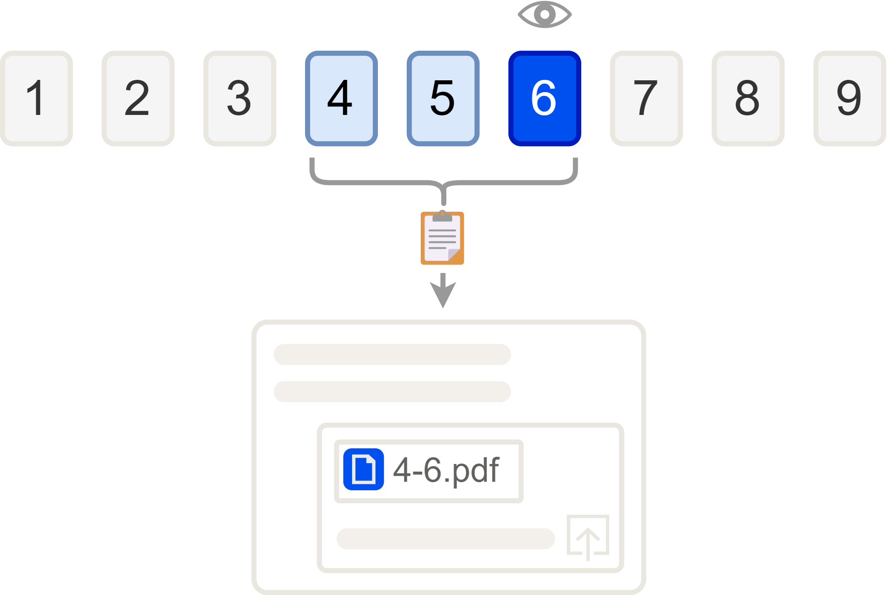

# PDFCrop

PDFCrop は、学習に使用するための PDF ファイル ビューアーです。表示中のページとその直前の数ページのみを切り出した PDF ファイルを生成し、クリップボードにコピーする機能を提供します。これを ChatGPT などに貼り付けることで、表示中のページに特化した質問が簡単にできるようになります。



## 主な機能

- ファイルダイアログ、コマンドライン、ドラッグ＆ドロップで PDF を開けます。
- ページのスクロールとズーム表示。ウィンドウサイズ変更時には幅に合わせて自動調整します。
- ページの非同期レンダリングとキャッシュにより、スムーズな表示を実現します。
- 右クリック、`Ctrl+左クリック`、または `Ctrl+C` で、現在のページ付近を新しい PDF としてクリップボードへコピーします。ページ数はツールバーで設定できます。
- ビューア上で右ドラッグまたはShift+左ドラッグすると、選択範囲を画像としてクリップボードへ取得できます。
- 最近開いたファイル、ウィンドウ位置、ズーム倍率、言語設定を自動保存します。
- 対応言語: 英語、日本語、簡体字中国語、繁体字中国語。

## インストール

### Windows ユーザー

1. [リリースページ](https://github.com/inoueakimitsu/pdfcrop/releases)から最新のインストーラー（PDFCrop_Setup.exe）をダウンロード
2. インストーラーを実行してセットアップウィザードに従ってください
3. スタートメニューから PDFCrop を起動できます

### 手動インストール（開発者向け）

1. Python 3.10 以降をインストールしてください
2. 依存パッケージをインストールします：

   ```bash
   pip install PyMuPDF Pillow PySide6
   ```

3. リポジトリをクローンし、以下で起動します：

   ```bash
   python main.py path/to/file.pdf
   ```

## 使い方

- **ファイルを開く**: メニューの `File -> Open` を選択するか、PDF をウィンドウへドラッグします。コマンドラインからファイル名を渡すことも可能です。
- **ページ操作**: マウスホイールや矢印キー、PageUp/PageDown でスクロールします。`Home` キーで先頭、`End` キーで末尾へ移動します。
- **ページをコピー**: `Ctrl+C`、右クリック、または Ctrl+左クリックすると、表示ページ付近が PDF としてクリップボードに保存されます。
- **画面キャプチャ**: 右ドラッグまたはShift+左ドラッグで範囲を選択すると、その部分の画像がクリップボードに保存されます。
- **言語の変更**: `Settings -> Language` から選択し、再起動すると反映されます。

## ライセンス

本プロジェクトは GNU AGPL v3 ライセンスの下で配布されています。詳細は `LICENSE` をご覧ください。

貢献者および外部ライブラリのライセンスについては `AUTHORS` を参照してください。
