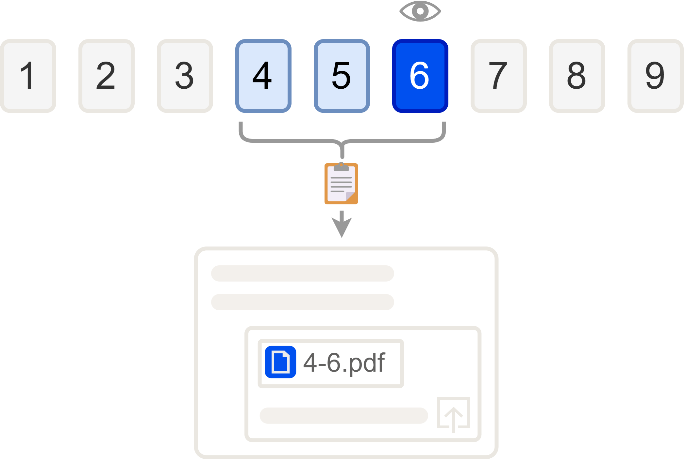
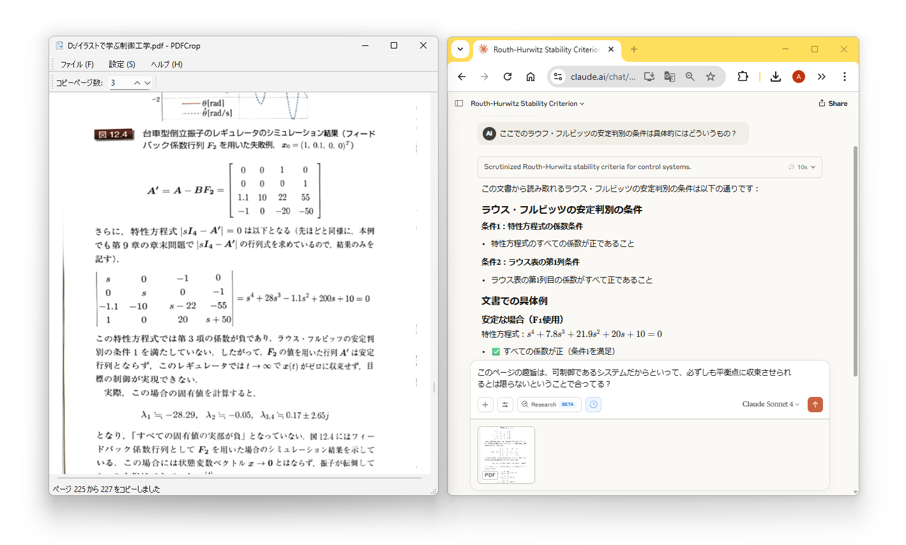

# PDFCrop

PDFCrop is a PDF viewer designed for learning purposes. It provides functionality to generate and copy a PDF file containing only the currently displayed page and a few preceding pages to the clipboard. By pasting this into ChatGPT or similar tools, you can easily ask questions specific to the pages you're viewing.



## Features

- Open PDF documents via file dialog, command line or drag & drop.
- Scroll and zoom pages; automatically fit pages to the window width when resized.
- Asynchronous page rendering with caching for smoother scrolling.
- Copy the current page and surrounding pages as a new PDF to the clipboard (right-click, `Ctrl+Left-click` or shortcut: `Ctrl+C`). The number of pages can be adjusted.
- Capture a selected screen area to the clipboard by right-dragging or Shift+Left-dragging on the viewer.
- Recent file information, window geometry, zoom level and language choice are saved automatically.
- Interface languages: English, Japanese, Simplified Chinese and Traditional Chinese.

## Screenshot



## Installation

### Windows Users

1. Download the latest installer (PDFCrop_Setup.exe) from the [Releases page](https://github.com/inoueakimitsu/pdfcrop/releases)
2. Run the installer and follow the setup wizard
3. Launch PDFCrop from the Start menu

### Manual Installation (for developers)

1. Install Python 3.10 or later
2. Install dependencies:

   ```bash
   pip install PyMuPDF Pillow PySide6
   ```
3. Clone this repository and run the application with Python:

   ```bash
   python main.py path/to/file.pdf
   ```

## Usage

- **Open File**: `File -> Open` or drag a PDF onto the window. A file path can also be passed on the command line.
- **Navigation**: Use the mouse wheel, arrow keys or Page Up/Down. Press `Home` or `End` to jump to the beginning or end.
- **Copy Pages**: Press `Ctrl+C`, right-click, or Ctrl+Left-click on the page to copy the visible page and nearby pages. The maximum number of pages is set in the toolbar.
- **Screen Capture**: Right-drag or Shift+Left-drag with the mouse to select an area; the captured image is placed on the clipboard.
- **Language**: Choose a language from `Settings -> Language` and restart the application to apply it.

## License

This project is distributed under the terms of the GNU Affero General Public License v3.0. See the `LICENSE` file for details.

For contributor information and third‑party licenses, see the `AUTHORS` file.
