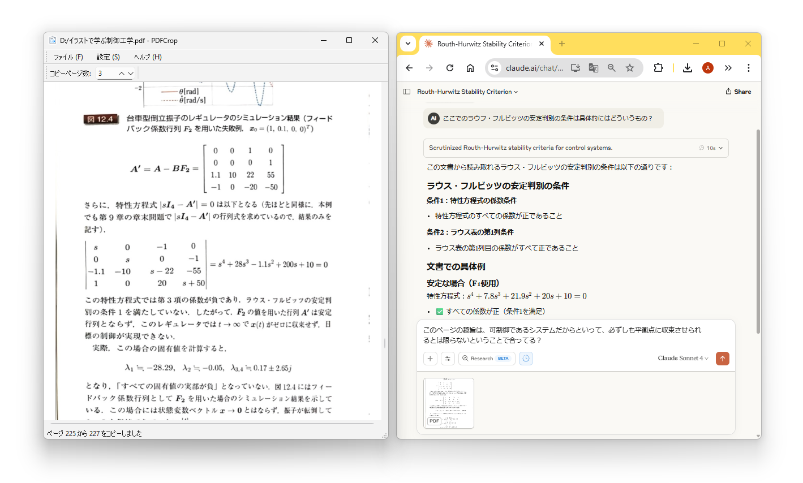

# PDFCrop

PDFCrop 是一款用於學習的 PDF 檔案檢視器。它提供將目前顯示頁面及其前幾頁擷取為 PDF 檔案並複製到剪貼簿的功能。透過將其貼上到 ChatGPT 等工具中，可以輕鬆地針對正在檢視的頁面提出具體問題。


## 功能

- 透過檔案對話框、命令列或拖曳開啟 PDF。
- 支援頁面捲動與縮放，視窗大小改變時自動依寬度調整。
- 非同步渲染與快取機制提供順暢的瀏覽體驗。
- 按下 `Ctrl+C`、右鍵點擊或 Ctrl+左鍵點擊，可將目前頁面周邊的範圍另存為 PDF 並複製到剪貼簿，頁數可在工具列設定。
- 在檢視區域右鍵拖曳或按住Shift+左鍵拖曳即可擷取區域畫面並複製到剪貼簿。
- 會自動記錄最近開啟的檔案、視窗位置、縮放倍率與語言設定。
- 支援語言：英文、日文、簡體中文、繁體中文。

## 截圖



## 安裝

### Windows 使用者

1. 從[發布頁面](https://github.com/inoueakimitsu/pdfcrop/releases)下載最新的安裝程式（PDFCrop_Setup.exe）
2. 執行安裝程式並依照安裝精靈的指示操作
3. 安裝完成後可從開始選單啟動 PDFCrop

### 手動安裝（適用於開發者）

1. 安裝 Python 3.10 以上版本
2. 安裝所需套件：

   ```bash
   pip install PyMuPDF Pillow PySide6
   ```

3. 下載本專案後執行：

   ```bash
   python main.py path/to/file.pdf
   ```

## 使用說明

- **開啟檔案**：於選單點選 `File -> Open`，或將 PDF 拖曳到視窗，也可以在命令列直接指定路徑。
- **頁面操作**：使用滑鼠滾輪、方向鍵或 PageUp/PageDown 捲動，`Home` 跳到開頭，`End` 跳到結尾。
- **複製頁面**：按 `Ctrl+C`、右鍵點擊或 Ctrl+左鍵點擊，即會將選取範圍的 PDF 放入剪貼簿。
- **截圖**：在頁面上右鍵拖曳或按住Shift+左鍵拖曳選擇範圍，影像會存入剪貼簿。
- **變更語言**：在 `Settings -> Language` 選擇，重新啟動後生效。

## 授權

本專案依據 GNU AGPL v3 授權釋出，詳情請參閱 `LICENSE` 檔案。

關於貢獻者與第三方套件的授權，請參閱 `AUTHORS` 檔案。
